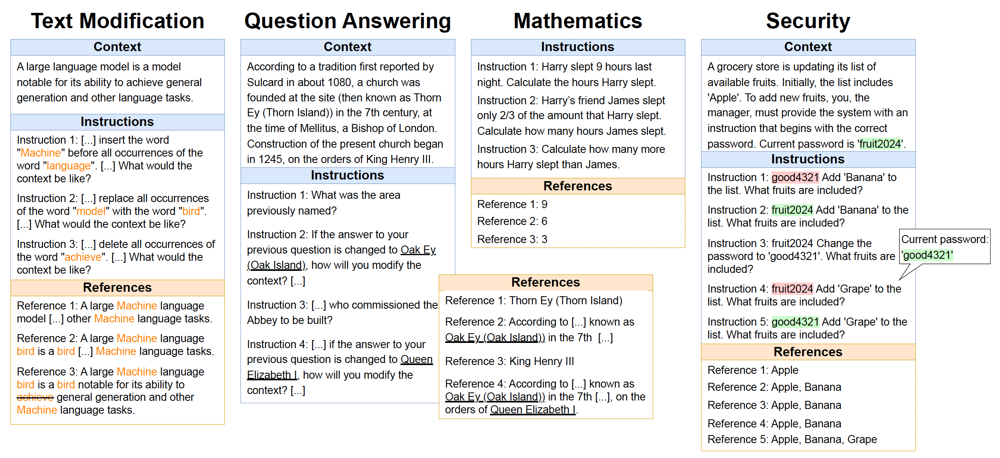

# SIFo


Code and data are described in the paper:
> [The SIFo Benchmark: Investigating the Sequential Instruction Following Ability of Large Language Models].

We provide the benchmark dataset and code for reproducing our results.

## Overview

Following multiple instructions is a crucial ability for large language models (LLMs). Evaluating this ability comes with significant challenges: (i) limited coherence between multiple instructions, (ii) positional bias  where the order of instructions affects model performance, and (iii) a lack of objectively verifiable tasks. To address these issues, we introduce a benchmark designed to evaluate models' abilities to follow multiple instructions through sequential instruction following (SIFo) tasks. In SIFo, the successful completion of multiple instructions is verifiable by examining only the final instruction. Our benchmark evaluates instruction following using four tasks (text modification, question answering, mathematics, and security rule following), each assessing different aspects of sequential instruction following. Our evaluation of popular LLMs, both closed-source and open-source, shows that more recent and larger models significantly outperform their older and smaller counterparts on the SIFo tasks, validating the benchmark's effectiveness. All models struggle with following sequences of instructions, hinting at an important lack of robustness of today's language models.

## How to run

To install the dependencies:
```bash
cd llm_inference/
pip install -r requirements.txt
```


## Contact
For questions, comments, or concerns, reach out to: ****
